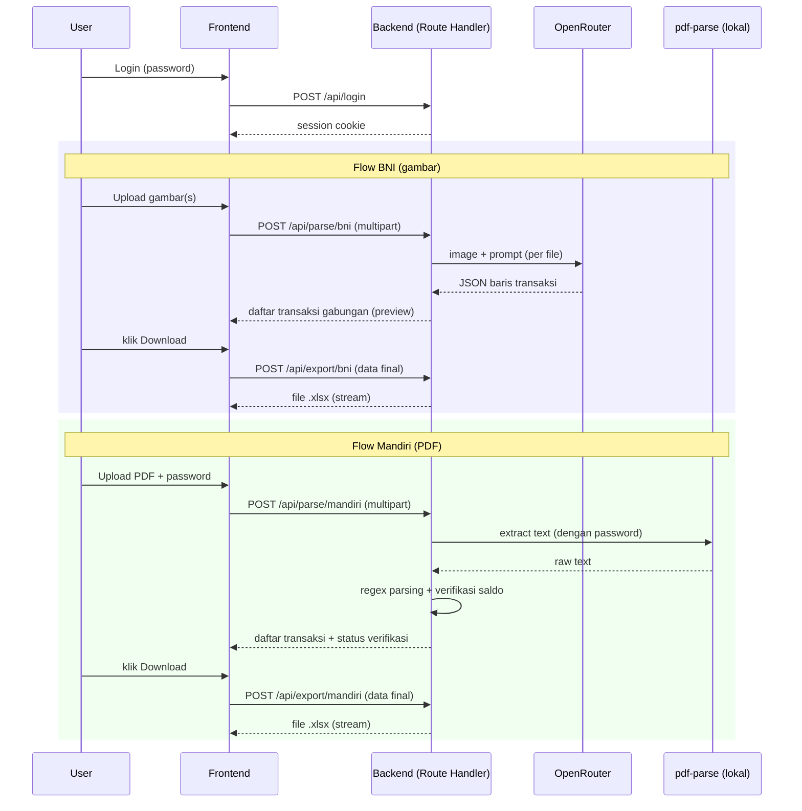

# PRD — Zaneva Mutasi (Parser Mutasi Bank ke Excel)

## 1. Overview
Tool internal untuk mengubah bukti mutasi rekening bank menjadi file Excel (.xlsx) siap pakai untuk rekonsiliasi pembayaran. Ada dua sumber: screenshot/foto mutasi **BNI** (gambar, diparsing pakai AI vision via OpenRouter) dan **e-Statement Mandiri** (PDF berpassword, diparsing langsung dari teks tanpa AI karena formatnya sudah konsisten). Dipakai sendiri oleh Rizky dari 2 PC berbeda, sehingga di-deploy sebagai web app di subdomain pribadi dengan proteksi password tunggal. Tidak ada penyimpanan data permanen — upload → proses → download, selesai.

---

## 2. Requirements

- **Aksesibilitas:** Web, desktop-first (dipakai di 2 PC), tidak perlu PWA/mobile-optimized khusus
- **Pengguna:** 1 orang (Rizky), tanpa role, tanpa multi-user
- **Auth:** Password tunggal via iron-session (env var `APP_PASSWORD`), bukan Google OAuth
- **Data Input:** Upload file — gambar (jpg/png, bisa multi-file sekaligus) untuk BNI; 1 file PDF (dengan password) untuk Mandiri
- **Export:** Excel (.xlsx), dibuat on-the-fly di server, langsung di-stream untuk didownload
- **Constraint khusus:** Stateless total — tidak ada database, tidak ada file yang disimpan permanen di server. Semua proses in-memory per-request.

---

## 3. Core Features

### 3.1 Login password tunggal (Must-have)
- Satu form password, dibandingkan dengan `APP_PASSWORD` dari env var
- Session via iron-session (cookie signed), tidak ada tabel user

### 3.2 Parse BNI — Gambar → Excel (Must-have)
- Upload satu atau banyak gambar sekaligus (screenshot mutasi yang di-scroll jadi beberapa gambar)
- Tiap gambar dikirim ke OpenRouter (`google/gemini-2.5-flash`) dengan prompt terstruktur untuk ekstrak baris transaksi
- Mapping kolom output: `TANGGAL | URAIAN TRANSAKSI | (kosong) | TYPE | JUMLAH PEMBAYARAN | SALDO`
  - `TYPE` diambil dari indikator "Db."/"Cr." pada gambar
  - Kolom kosong (kolom ke-3) sengaja dikosongkan sesuai format contoh yang diberikan
- Hasil parsing dari semua gambar digabung jadi satu daftar transaksi, diurutkan tanggal
- Preview hasil di tabel sebelum download — baris yang AI tandai "tidak yakin/buram" diberi highlight merah supaya bisa dihapus manual
- Tombol "Download Excel" men-generate dan mendownload file

### 3.3 Parse Mandiri — PDF → Excel (Must-have)
- Upload 1 file PDF e-Statement
- Field password PDF, default terisi `02071993`, bisa diubah user kalau beda
- Extract teks PDF di server (library `pdf-parse`), lalu diparsing dengan regex (format Mandiri sudah konsisten: tanggal+jam, keterangan multi-baris, nominal `+`/`-`, saldo berjalan) — **tanpa AI/OpenRouter**
- Mapping kolom output: `TANGGAL | TRANSAKSI | DEBIT | KREDIT | SALDO`
- Verifikasi otomatis: Saldo Awal + Σ(Kredit) − Σ(Debit) harus sama dengan Saldo Akhir yang tertulis di header statement. Kalau tidak cocok → tampilkan warning (selisihnya berapa), tapi tetap izinkan download
- Preview hasil di tabel sebelum download
- Tombol "Download Excel"

### 3.4 Validasi & Error Handling (Must-have)
- File selain image untuk BNI / selain PDF untuk Mandiri → ditolak dengan pesan jelas
- Password PDF salah → pesan error jelas, bukan crash
- OpenRouter gagal (limit, timeout, API error) → pesan error jelas, user bisa retry
- Tidak pernah mengarang baris transaksi yang tidak terbaca — hanya menandai sebagai "tidak yakin"

---

## 4. User Flow

### Flow BNI
1. Login dengan password
2. Buka tab "BNI (Gambar)"
3. Upload satu atau beberapa gambar screenshot mutasi
4. Klik "Proses" → tiap gambar dikirim ke OpenRouter, tampil loading per-gambar
5. Hasil gabungan tampil di tabel preview (baris tidak yakin ditandai merah, bisa dihapus)
6. Klik "Download Excel" → file `Mutasi_BNI_<YYYY-MM-DD>.xlsx` terdownload

### Flow Mandiri
1. Login dengan password
2. Buka tab "Mandiri (PDF)"
3. Upload PDF, isi/konfirmasi password (default `02071993`)
4. Klik "Proses" → server extract teks & parsing regex
5. Tampil preview tabel + info verifikasi saldo (✅ cocok / ⚠️ selisih Rp sekian)
6. Klik "Download Excel" → file `Mutasi_Mandiri_<YYYY-MM-DD>.xlsx` terdownload

### Edge Cases
- Gambar blur/terpotong → baris ditandai "tidak yakin", tidak di-skip diam-diam, user yang putuskan hapus atau tidak
- PDF tanpa password atau password salah → pesan error spesifik ("Password PDF salah, coba lagi")
- Saldo Mandiri tidak balance → warning kuning dengan angka selisih, tetap bisa lanjut download
- Upload kosong / format file salah → validasi di frontend dan backend (double check)
- Ukuran file kebesaran (>10MB) → ditolak dengan pesan jelas

---

## 5. Architecture

---

## 6. Database Schema

**Tidak ada database.** Aplikasi fully stateless — tidak ada tabel, tidak ada ORM. Session login hanya cookie signed (iron-session), tidak disimpan di server.

| Tabel | Fungsi |
|-------|--------|
| — | Tidak ada tabel. Semua data transaksi hidup sementara di memori request, dibuang setelah response dikirim. |

---

## 7. Design & Technical Constraints

### Tech Stack
- **Frontend:** Next.js 16 App Router, React 19, TypeScript, Tailwind v4
- **Backend:** Next.js Route Handlers (tanpa Express terpisah)
- **OCR AI:** OpenRouter API, model `google/gemini-2.5-flash`, dipanggil dari server saja (API key tidak pernah ke client)
- **PDF parsing:** `pdf-parse` (atau `pdfjs-dist` kalau perlu dukungan password lebih baik) + regex kustom format Mandiri
- **Excel generation:** `exceljs`
- **Auth:** iron-session, 1 password dari env var, tanpa database user
- **ORM/Database:** Tidak dipakai (dikecualikan secara sadar dari baseline stack karena app ini stateless — tidak ada entitas untuk disimpan)
- **Deploy:** EasyPanel, Dockerfile, subdomain `mutasi.mrrizky.my.id`

### UI System
- Ikuti standar tema existing: light + dark mode (ikut OS, bisa override), WCAG AA, `SearchableSelect` untuk dropdown (dipakai untuk pilih tab bank jika berupa dropdown, meski tab biasa juga cukup)
- Label UI Bahasa Indonesia, istilah bisnis (Debit, Kredit, Saldo, Export, Upload) tetap aslinya

### Naming Convention
- Label UI & field bisnis: Bahasa Indonesia
- Fungsi/variabel/komponen: Bahasa Inggris, camelCase/PascalCase
- API routes: kebab-case (`/api/parse/bni`, `/api/export/mandiri`)

### Business Logic Hardcoded
- Kolom BNI: `TANGGAL, URAIAN TRANSAKSI, (kosong), TYPE, JUMLAH PEMBAYARAN, SALDO`
- Kolom Mandiri: `TANGGAL, TRANSAKSI, DEBIT, KREDIT, SALDO`
- Default password PDF Mandiri: `02071993` (prefill, bisa diganti user)
- Model OCR: `google/gemini-2.5-flash` via OpenRouter (bisa diganti lewat env var `OPENROUTER_MODEL` kalau mau ganti model nanti)
- Verifikasi saldo Mandiri: `SaldoAwal + ΣKredit − ΣDebit == SaldoAkhir` (toleransi Rp 1 untuk pembulatan)

### Constraint Lain
- `OPENROUTER_API_KEY` hanya ada di server (env var), tidak pernah dikirim ke browser
- `APP_PASSWORD` dibandingkan di server saja, cookie session yang dikirim ke browser
- Maks ukuran file: 10MB per file, maks 10 file sekaligus untuk BNI
- Tidak ada log/penyimpanan isi mutasi bank di server (privasi data finansial)

---

## Catatan Implementasi
- API key OpenRouter yang diberikan user akan disimpan langsung ke `.env` lokal (tidak masuk git/repo), bukan di-hardcode di source code.
